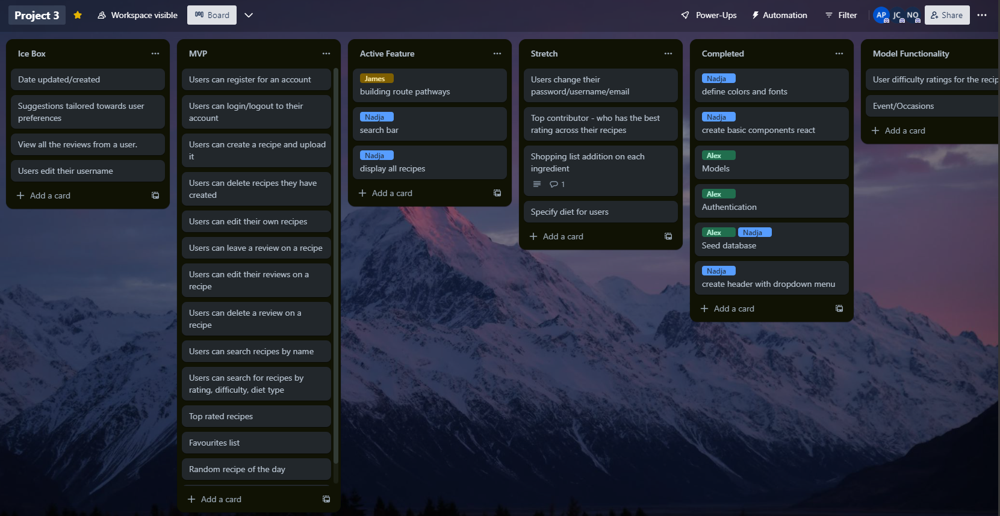
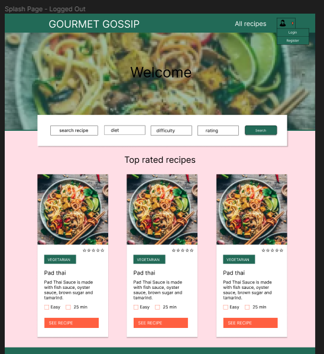
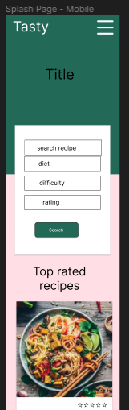
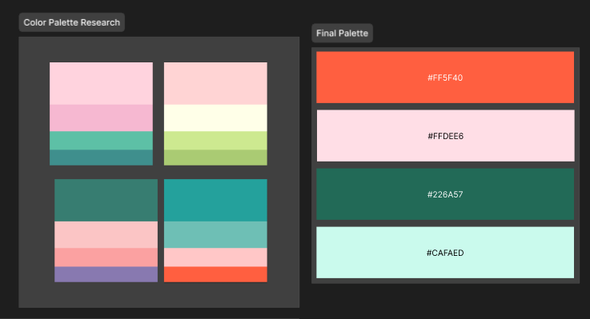
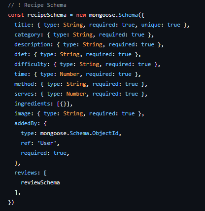
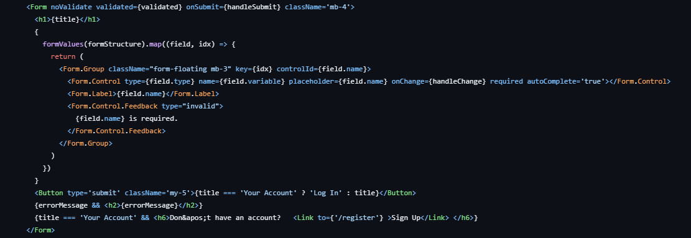
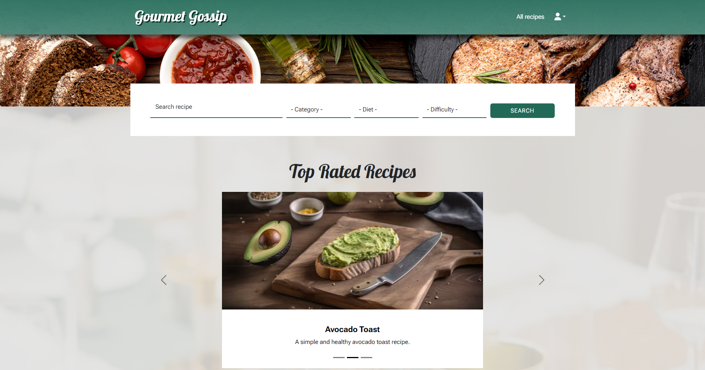
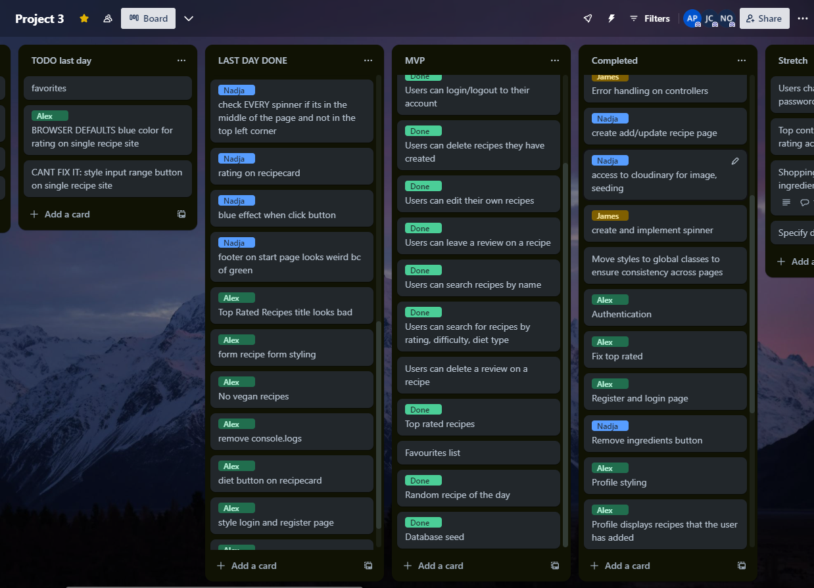
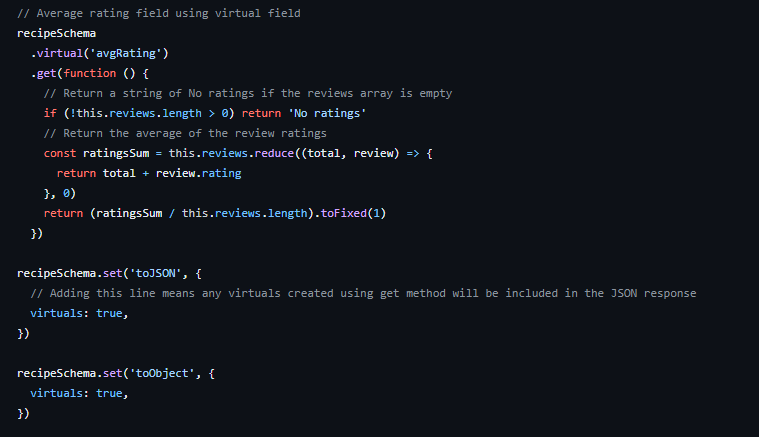

# Gourmet Gossip

## Description

Gourmet Gossip is a recipe sharing website where users can create, edit and delete recipes and leave reviews for recipes that they enjoy.

[Nadjaob](https://github.com/nadjaob), [jchesher92](https://github.com/jchesher92) and I were given 7 days to complete our project as a group. We initially researched and created a wireframe on [figma](https://www.figma.com/file/qrek2uENdq7sUzyKiliVPP/Project-3?type=design&node-id=0%3A1&mode=design&t=yuz0fOXCGQmQYVJc-1). We then divided tasks up using trello to identify which features we would work on. James would focus on back-end, Nadja on front-end and I would float between picking up features as needed.

## Deployment Link

[Live deployment here](https://gourmet-gossip-665d7e750e14.herokuapp.com/)

## Project Brief

- Build a full-stack application by making your own backend and your own front-end
- Use an Express API to serve your data from a Mongo database
- Consume your API with a separate front-end built with React
- Be a complete product which most likely means multiple relationships and CRUD functionality for at least a couple of models
- Implement thoughtful user stories/wireframes that are significant enough to help you know which features are core MVP and which you can cut
- Have a visually impressive design to kick your portfolio up a notch and have something to wow future clients & employers. ALLOW time for this.
- Be deployed online so it's publicly accessible.

## Code Process

### Day 1

We initially met as a group and discussed the planning including collaborating on figma and creating a trello board to map out the features that each of us would work on.

### Day 2

I created the models based on the figma plan we had decided on, used chatGPT to create seeded data and assisted James with creating controllers for the endpoints.

### Day 3

Created basic login and register pages, applied simple styling and added authentication routes to prevent multiple users with the same username or email address. Validate both passwords are the same and store as a hash using bcrypt.

### Day 4

Created a profile page for users, add ‘addedby’ field to display the recipes that each individual user has created. Add a redirect if the user is not logged in. 

### Day 5

Included Top rated feature carousel, include virtual field on the model to calculate the average ratings of each recipe’s reviews so that the top rated recipes are displayed on the home page.

### Day 6

Assist James with attempting to implement a favourites feature
Restyled login and register pages to display a message and fixed the padding/margins for mobile

### Day 7

Final styling and editing changes. Added new fonts to titles. Restructured seed to include vegan recipes. Removed all console.logs and forms that were causing browser errors (duplicate id’s). Added the diet button as an overlay for the recipe card page to gain more space for the description. Renamed intermediate to medium in order to prevent line breaks on recipe cards

My main contributions included developing the seed data using AI generated recipes, using this seed data to shape the mongoose models. creating login and register forms including requests to the mongoose/express backend. This included authentication routes and validation using bcrypt. I then applied error handling and display for the user for invalid inputs.

## Challenges

- There were some issues with getting a user favourites button to work, the group member in charge was eventually unable to implement the feature. In future I would try to stay more closely in touch with how members of my group are working, looking into their commits to gain insight into their working habits and what their strengths and weaknesses are.

- We had a lot of trouble trying to style the browser default select and slider button defaults, we now know that -webkit is the selector that is necessary to target the options.

- We used Trello to stay in touch with what each member was working on each day, unfortunately one member was not keeping up to date with the trello board which meant that some work was doubled up, showing the necessity of looking at commits and not just relying on project management tools.

## Wins

Adding a virtual field to the recipe to calculate the average value of all the ratings

Through the process of creating this recipe collection website using the MERN (MongoDB, Express.js, React, Node.js) stack, I have significantly bolstered my confidence and proficiency in several key technologies and tools. 
- MongoDB became integral to managing and storing recipe data efficiently, and I gained a deeper understanding of its document-oriented structure and flexible schema. 
- Express.js allowed me to build a robust and scalable server-side application, providing a solid foundation for handling HTTP requests and creating a RESTful API.
- Developing the frontend with React not only enhanced the user interface but also strengthened my grasp on component-based architecture and state management, thanks to features like hooks and useContext. 

## Future Improvements

- Allow users to change their password/username/email

- Add a top contributor page with the user that has the highest ratings

- Add a diet choice for users to sort by preferences

- Add a shopping list function for users to add ingredients to their list for later.
